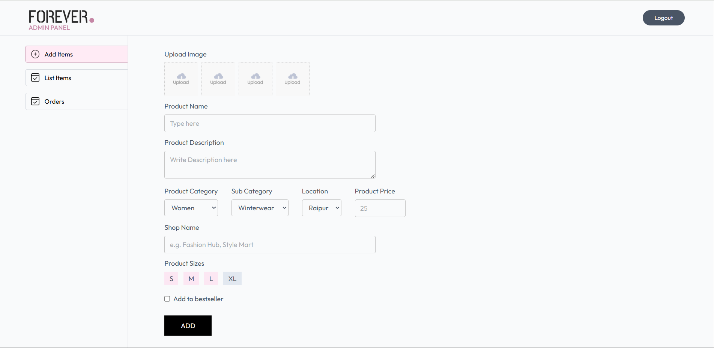
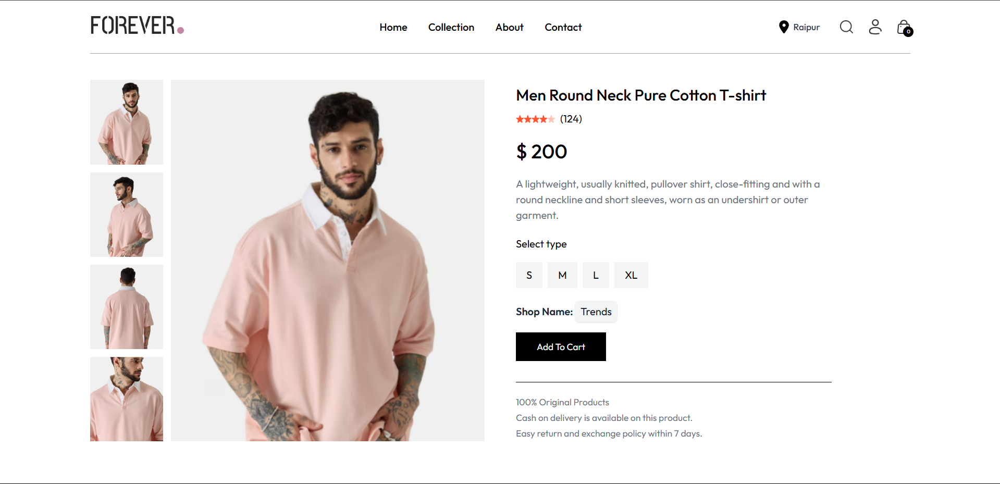

# Full Stack E-commerce Web App
This is a full stack E-commerce Web App project build using **MERN Stack** (MongoDB, Express, React, Node.js). In this project users can browse Collections, Add to Cart, Pay through COD or Razorpay, track theri order. Admin can add, update, delete products from admin panel. 

 





## Features: 
-Product Items Page
-Product Display Page
-Seach and sorting feature
-Cart Page
-Place Order Page : COD or Razorpay payment gateway
-Your Orders Page
-Create Account and Login/Logout Page with JWT Authentication

## Admin Panel where Admin can : 
* Add Products
* Update Products
* Delete Products

## 🖥️ Setup Instructions

1. **Clone the repository**:
    ```bash
    git clone https://github.com/vinay-0913/News-Aggregator-with-Recommendation-System.git
    ```
2. **Install dependencies**:
   - Navigate to the front, backend, admin directory and run:
    ```bash
    npm install
    ```
3. **Add Environmental Variables**
   - Create .env file all directories :
    - In frontend :
     ```bash
    VITE_BACKEND_URL = http://localhost:4000
    VITE_RAZORPAY_KEY_ID = ' '
    ```
    - In backend : 
     ```bash
    MONGODB_URI = " "
    CLOUDINARY_API_KEY = " "
    CLOUDINARY_SECRET_KEY = " "
    CLOUDINARY_NAME = " "
    JWT_SECRET = " "
    ADMIN_EMAIL = " "
    ADMIN_PASSWORD = " "
    RAZORPAY_KEY_SECRET = ''
    RAZORPAY_KEY_ID = ' '
    ```
    - In admin :
     ```bash
    VITE_BACKEND_URL = 'http://localhost:4000'
    ```
4. **Start the development server**:
   - Run the backend server:
   ```bash
    nodemon
    ```
    - Run both frontend & backend server:
   ```bash
    npm run dev
    ```
  

